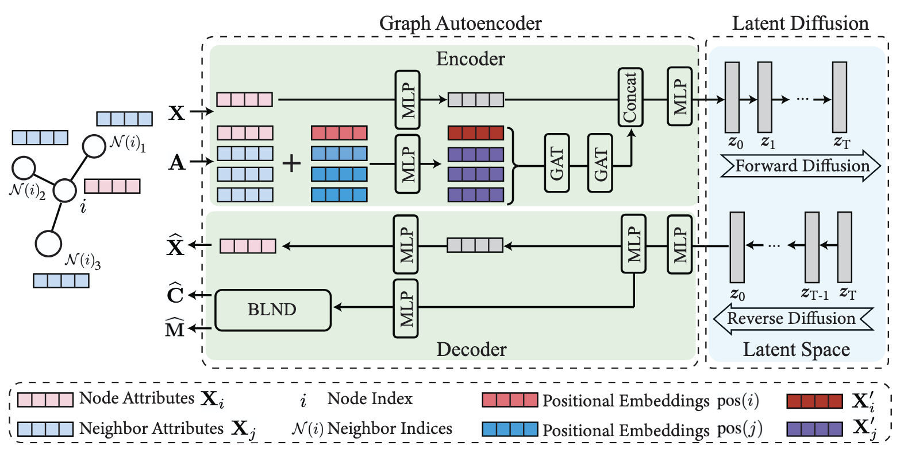

# Diffsion on Graph (DoG)

Graph diffusion models have recently been proposed to synthesize entire graphs, such as molecule graphs. Although existing methods have shown great performance in generating entire graphs for graph-level learning tasks, no graph diffusion models have been developed to generate synthetic graph structures, that is, synthetic nodes and associated edges within a given graph, for node-level learning tasks. Inspired by the research in the computer vision literature using synthetic data for enhanced performance, we propose Diffusion on Graph (DoG), which generates synthetic graph structures to boost the performance of GNNs. The synthetic graph structures generated by DoG are combined with the original graph to form an augmented graph for the training of node-level learning tasks, such as node classification and graph contrastive learning (GCL). To improve the efficiency of the generation process, a Bi-Level Neighbor Map Decoder (BLND) is introduced in DoG. To mitigate the adverse effect of the noise introduced by the synthetic graph structures, a low-rank regularization method is proposed for the training of graph neural networks (GNNs) on the augmented graphs. Extensive experiments on various graph datasets for semi-supervised node classification and graph contrastive learning have been conducted to demonstrate the effectiveness of DoG with low-rank regularization. 




## Demo Usage on the Cora Dataset

### Step 1: Training GAE

```
python train_vae.py \
    --moddir your-model-save-path \
    --samdir your-sample-save-path \
    --epoch 3000 \
    --norm 1 \
    --hidden_sizes 512 256 64 \
    --intervalplot 30  \
    --interval 30 \
    --coef_kl 0
```

Encode embedding to the latent features

```
python train_vae.py \
    --moddir your-model-save-path \
    --samdir your-sample-save-path \
    --lastepo 3000 \
    --norm 1 \
    --hidden_sizes 512 256 64 \
    --run_type encode
```

### Step 2: Training The Latent Diffusion Model


Train the diffusion model

```
python  train_diff.py --batchsize 256 \
    --modch 64 \
    --moddir your-model-save-path \
    --samdir your-sample-save-path \
    --epoch 3000 \
    --interval 30 \
    --intervalplot 1 \
    --nettype unet_1d \
    --inch 1 \
    --outch 1 \
    --inputsize 64 \
    --clsnum 7 \
    --datatype gclemb \
    --datadir ./embeds/all_embs.npy \
    --labeldir ./embeds/all_ps_labels.npy \
    --genum 140 \
    --genbatch 140  \
    --norm 1
```

### Step 3: Sample Node Embeddings

```
python sample.py --genum 70 \
    --genbatch 70 \
    --modch 64 \
    --moddir your-model-save-path \
    --samdir your-sample-save-path \
    --epoch 1200 \
    --ddim yes \
    --num_steps 50 \
    --nettype unet_1d \
    --inch 1 \
    --outch 1 \
    --inputsize 64 \
    --clsnum 7 \
    --datadir ./embeds/all_embs.npy \
    --labeldir ./embeds/all_ps_labels.npy \
    --norm 1
```

Decode the latent features to the embeddings

```
python train_vae.py \
    --moddir your-model-save-path \
    --samdir your-sample-save-path \
    --lastepo 3000 \
    --norm 1 \
    --hidden_sizes 512 256 64 \
    --run_type decode \
    --datadecode_dir your-sample-save-path
```

### Step 4: Node Classification

```
python transductive_train.py \
  --dataset cora \
  --real_embeds_path ./embeds/all_embs.npy \
  --generated_embeds_path your-generated-embeds-path \
  --generated_labels_path your-generated-labels-path \
  --output_dir your-output-dir \
  --sample_per_class 20 \
  --K 2 \
  --try_num 2000 \
  --device cuda:1 \
  --feat_dim 512 \
  --num_classes 7 \
  --learning_rate 0.01 \
  --weight_decay 5e-6 \
  --epoch_num 1000
```
